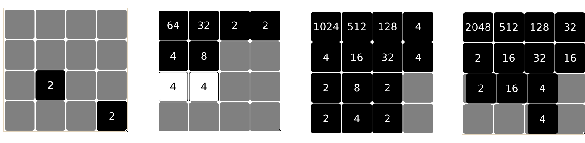

# Solving 2048
### by Daniil Kuznetsov

*'2048 is a simple game to play, but that does not imply that it is easy to solve. This is because of the immense state spaces which can be generated via the application of the 4 actions the player can execute. The merging of nodes after each action along with the procedural generation of a new node into the grid, allows the game system to terminate after a sufficient number of moves within the restricted 4x4 grid space, but the merging property makes it difficult to precisely estimate the volume of possible states which can be generated by the game.
This chapter focuses on going over all of the components which make up the specification of 2048, as well as the impacts they will have on creating an algorithm that is able to solve the game.'*

## Dependencies:
- java >= 15
- maven >= 3.8.3 (Only to recompile, not necessary to run anything)
## Getting started:

All the programs in this project are ran via a single .jar file called *'2048.jar'*, that accepts command line arguments.

```java -jar 2048.jar --help```

### Precompiled programs (Easiest to run):

The *'precompiled/'* folder contains .jar files that have been compiled with built in settings. These programs are meant to give a genera overview of the capabilities of the application, with further custom configuration available via command line arguments (See section below).

```
precompiled/
  lookahead_4x4_2steps_gui.jar
      'A good demonstration of the best algorithm created in this project solving the base 2048 game.'
      
  threaded_lookahead_4x4_3steps_gui.jar
      'The threaded version that has an additional step of lookahead, should have slightly 
      better performance but is slower in practise.'
      
  optimal_2x2_16_gui.jar
      'Optimal algorithm executing on a very simple, downscaled version of 2048. 
      Attempting to play at higher win conditions than 16 quickly becomes unfeasable.'
  
  lookahead_4x4_2steps_text_100games.jar
      'Same as the first .jar file, but instead plays out the lookahead across 100 games on a 
      text interface. Summary of wins and losses is provided at the end of the experiment.'
      
  lookahead_5x5_circle_2steps_gui.jar
      'A more unorthodox game grid, notice how the highscore heuristic is used instead.'
  
  player_4x4.jar
      'Simple iteration that allows the user to play the game'
```

Running each of the precompiled programs is as simple, as running a .jar file:

  ```java -jar lookahead_4x4_2steps_gui.jar```
   

### Command line configuration:
The above command will give an overview of all the basic configuration parameters that can be specified into the application.

This project has two distinct interfaces, a text and a GUI. The GUI can be initialized by passing the *'--gui'* argument to 2048.jar. The text interface works by passing in user controls in a dynamic fashion, whilst the GUI directly executes the keypresses. Note that one is able to pass sequences of commands into the text interface.

```
Usage:
  --ARGUMENT <TYPE> [DEFAULT VALUE] {SUPPORTED INTERFACE}

Options:
  --map <STRING> ["####|####|####|####"]
        Construct a string map representation of the 
        grid, on which to play out the game.

        Symbols:
            | == Separator of grid rows
            # == Empty node
            x == Brick node
            2 == Value node 2
            4 == Value node 4
            8 == Value node 8

        Example:
          "####|2###|#2##|####"

              |    |    |
          -------------------
             2|    |    |
          -------------------
              |   2|    |
          -------------------
              |    |    |
   

  --algo <player|optimal|lookahead|lookahead_threaded> [player]
        The algorithm to use, note that 'player' simply
        allows the user to play the game themselves.

  --win <INTEGER> [2048] {TEXT INTERFACE ONLY}
        The value of the victory node.

  --nogen <BOOL> [false]
        If true, will not generate the two starting 
        nodes.

  --s <INTEGER> [2]
        Lookahead steps, will only take effect if any 
        of the lookahead alrogrithms is specified.

  --n <INTEGER> [1] {TEXT INTERFACE ONLY}
        Number of games to play out.

  --heuristic <empty|highscore|order> [order]
        Lookahead heuristic to use when evaluating 
        leafe states.

  --gui
        Enables GUI interface.

```

#### Example programs:
  
  1. *java -jar 2048.jar --algo lookahead --map "####|####|####|####" --s 2 --gui --heuristic order*

  2. *java -jar 2048.jar --algo lookahead_threaded --map "####|####|####|####" --s 3 --gui --heuristic order*

  3. *java -jar 2048.jar --algo optimal --map "##|##" --win 16 --gui*
  
  4. *java -jar 2048.jar --algo lookahead_threaded --s 2 --heuristic order --n 100*

  5. *java -jar 2048.jar --algo lookahead_threaded --map "xx#xx|x###x|#####|x###x|xx#xx" --s 2 --gui --heuristic highscore*

  6. *java -jar 2048.jar --algo player*
  

## Algorithms:

### Optimal
  The best, but the least practical algorithm. It is only feasible for 2x2 instances of 2048, with the maximal possible win condition being 32. A 3x3 grid will also work with win condition of 8, but 16 it becomes computatinally impractical.

### Lookahead
  Achieves consistent 93% win rates for the base version of 2048, with 2 step lookahead and order heuristic. 3 step lookahead ahead does not seem to impact the average win rate, out of the samples that have been documented, and 4 steps ahead becomes computantionally impractical.
  
### Player
  Allows the player to play the game and make moves themselves.


## Player controls:
Each command is entered via stdin (ascii within single quotes below) if using the text interface, or will be processed by the javafx UI thread if the GUI is used.

#### Movement:
- 'w' = Shift every node up
- 'd' = Shift every node right
- 's' = Shift every node down
- 'a' = Shift every node left

#### Miscellaneous:
- 'u' = Undo the most recent action, note that taking an                action after an undo will overwrite the redo buffer.
- 'r' = Redo the most recent action
- 'x' = Restart the game

#### System:
- 'q' = Exit game


## Custom map examples:
**NOTE WHEN USING NON-STANDARD MAPS IT IS HIGHLY RECOMMANDED TO NOT USE THE 'order' HEURISTIC WHEN USING LOOKAHEAD, USE 'highscore' INSTEAD.**

"xx#xx|x###x|#####|x###x|xx#xx"
```
    XXXX|XXXX|    |XXXX|XXXX
    ------------------------
    XXXX|    |    |    |XXXX
    ------------------------
        |    |    |    |
    ------------------------
    XXXX|    |    |    |XXXX
    ------------------------
    XXXX|XXXX|    |XXXX|XXXX
```

"####|#xx#|#xx#|####"
```
        |    |    |
    -------------------
        |XXXX|XXXX|
    -------------------
        |XXXX|XXXX|
    -------------------
        |    |    |
```

"x###x|#####|##x##|#####|x###x"
```
    XXXX|    |    |    |XXXX
    ------------------------
        |    |    |    |
    ------------------------
        |    |XXXX|    |
    ------------------------
        |    |    |    |
    ------------------------
    XXXX|    |    |    |XXXX
```

"#x#|###|#x#"
```
        |XXXX|
    --------------
        |    |
    --------------
        |XXXX|
```

## Small difference in text and GUI interface functionality:
Because GUI is inteded to not be used during large scale experimentation, but as a pretty feedback to the user, it will keep playing past the number 2048. Meanwhile the text interface will terminate at 2048, as this interface was used predominantely to run experiments for the project and it was important to finish running each game as soon as possible for the sake of running time.

## Directory layout:

src/main/java/cs3822/
    Code for every class within the project, annotated with code comments
    
javadoc/
    Generated javadoc, use a webrowser to open index.html or simply navigate to the code to read the documentation

This project uses the Maven Java Build Tool standard directory structure, whose documentation may be found here: https://maven.apache.org/guides/introduction/introduction-to-the-standard-directory-layout.html
