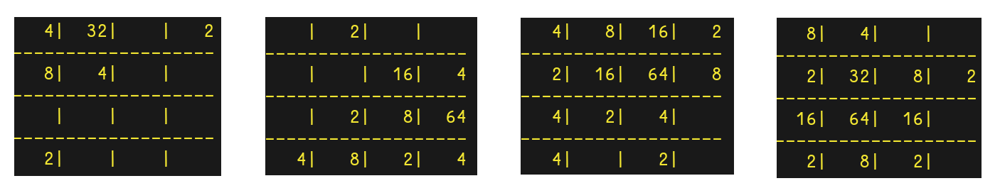

# Solving 2048
### by Daniil Kuznetsov



*'2048 is a simple game to play, but that does not imply that it is easy to solve. This is because of the immense state spaces which can be generated via the application of the 4 actions the player can execute. The merging of nodes after each action along with the procedural generation of a new node into the grid, allows the game system to terminate after a sufficient number of moves within the restricted 4x4 grid space, but the merging property makes it difficult to precisely estimate the volume of possible states which can be generated by the game.
This chapter focuses on going over all of the components which make up the specification of 2048, as well as the impacts they will have on creating an algorithm that is able to solve the game.'*

## Dependencies:
- Maven == 5.5.0
- Java == 17

## Getting started:

- Play the game:
  
  ```java -jar cli_2048.jar```

- Compute optimal model for 2x2 grid with a random initial state:

  ```java -jar optimal_2x2_16_algo.jar```

- Compute optimal model for 3x3 grid with a random initial state:

  ```java -jar optimal_3x3_256_algo.jar```

## Directory layout:

This project uses the Maven Java Build Tool standard directory structure, whose documentation may be found here: https://maven.apache.org/guides/introduction/introduction-to-the-standard-directory-layout.html

